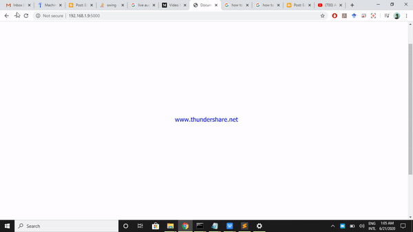

# Live_Video_steaming
In this sample project Live video and Audio Steaming has been illustrated using Python flask

##Run it as
cmd>>python app.py

##Open Browser
Request to Url = http://localhost:5000

#Sample OutPut

